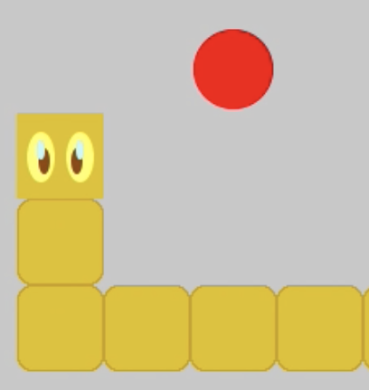
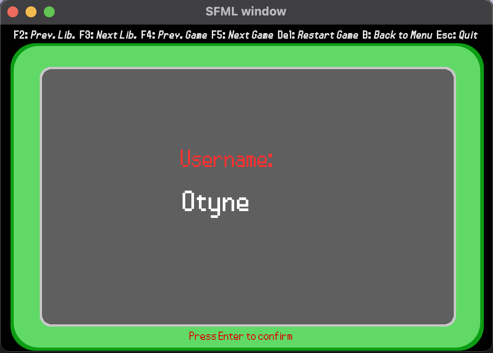
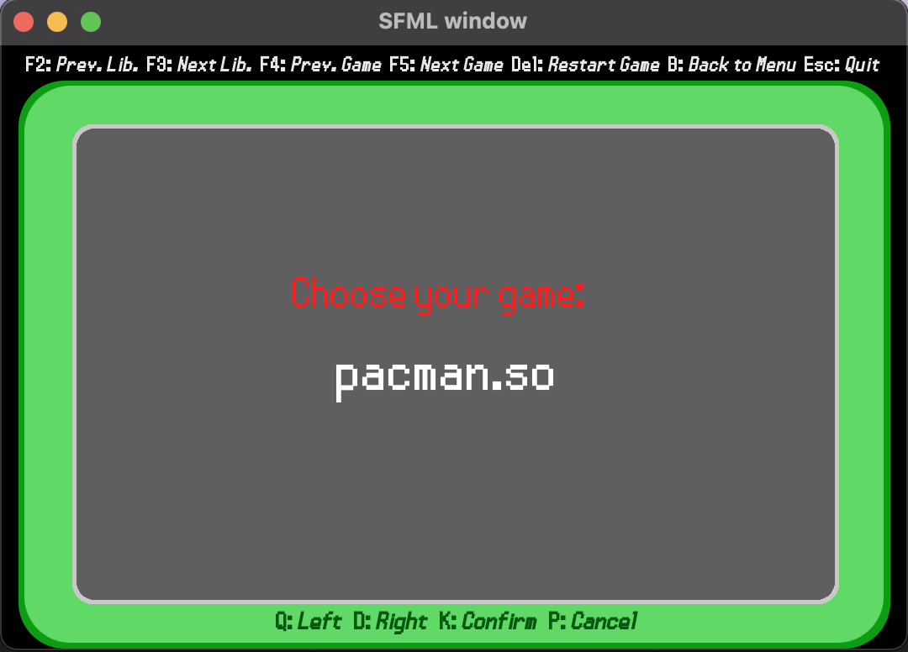
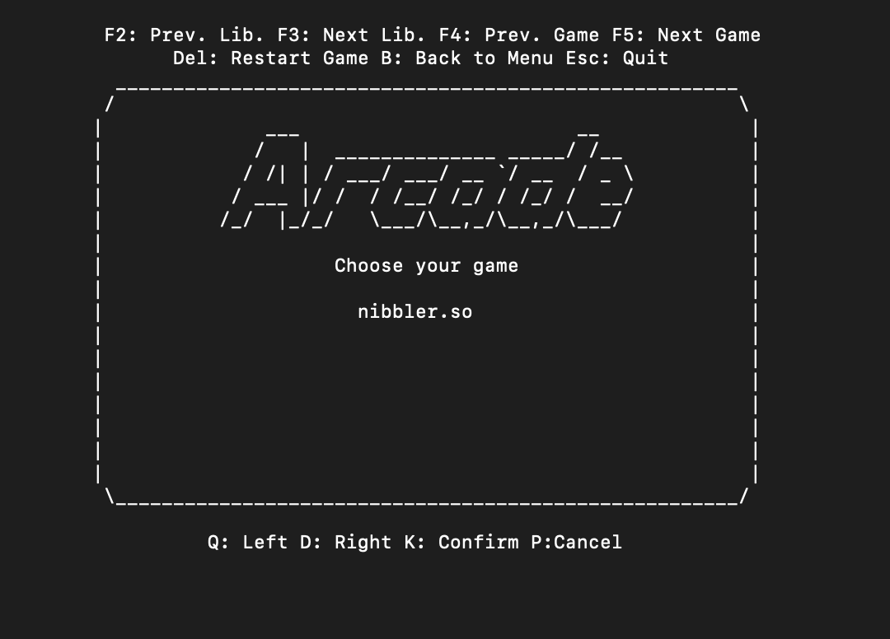

<!-- PROJECT LOGO -->
<br />
<p align="center">
  <a href="https://github.com/nicklamyeeman/my_arcade">
    
  </a>

  <h3 align="center">ARCADE</h3>

  <p align="center">
    Simulation of an arcade terminal 
    <br />
    <a href="https://github.com/nicklamyeeman/my_arcade"><strong>Explore the docs »</strong></a>
    <br />
    <br />
    <a href="https://github.com/nicklamyeeman/my_arcade/issues">Report Bug</a>
    ·
    <a href="https://github.com/nicklamyeeman/my_arcade/issues">Request Feature</a>
  </p>
</p>


<!-- TABLE OF CONTENTS -->
## Table of Contents

* [About the Project](#about-the-project)
  * [Built With](#built-with)
* [Getting Started](#getting-started)
  * [Prerequisites](#prerequisites)
  * [Installation](#installation)
* [Usage](#usage)
* [Roadmap](#roadmap)
* [Contributing](#contributing)
* [Contact](#contact)
* [Acknowledgements](#acknowledgements)


<!-- ABOUT THE PROJECT -->
## About The Project

This project is one of the first projects aiming at understanding the object-oriented programming and the compilation of shared libraries.
The goal was to separate games from graphical engines. So there are in this project 3 graphical engine libraries compiled in shared libraries (SFML, SDL and ncurses) for 2 games also compiled in shared libraries (Nibbler & Pacman).
PS : Only the Nibbler game is fully functional.
PS2 : The SFML library has Clock problems (the animations are too fast


### Built With

* [SFML](https://www.sfml-dev.org/download/sfml/2.5.1/)
* [SDL](https://www.libsdl.org/download-2.0.php)
* [ncurses](https://invisible-island.net/ncurses/announce.html)


<!-- GETTING STARTED -->
## Getting Started

To get a local copy up and running follow these simple steps.

### Prerequisites

Be sure you have SFML, SDL2, SDL2_image, SDL2_ttf and ncurses installed on your PC, then open a terminal

### Installation

1. Clone the repo
```sh
git clone https://github.com/nicklamyeeman/my_arcade.git
```
2. Compile it
```sh
make
```


<!-- USAGE -->
## Usage

### Example

```sh
./my_arcade lib/lib_arcade_sfml.so
```


Choose your game
<br/>



Every usable keys are displayed on the screen : 

<kbd>F2</kbd> : Previous Lib
<kbd>F3</kbd> : Next Lib
<kbd>F4</kbd> : Previous Game
<kbd>F5</kbd> : Next Game
<kbd>DEL</kbd> : Restart Game
<kbd>B</kbd> : Back to Menu
<kbd>ESC</kbd> : Quit


<kbd>Z</kbd> : Up
<kbd>Q</kbd> : Left
<kbd>S</kbd> : Down
<kbd>D</kbd> : Right
<kbd>K</kbd> : Confirm
<kbd>P</kbd> : Cancel



The same game and the same save is played while changing graphical library


### BE CAREFUL
SFML lib isn't really well implemented and pacman game isn't finished. 


<!-- ROADMAP -->
## Roadmap

See the [open issues](https://github.com/nicklamyeeman/my_arcade/issues) for a list of proposed features (and known issues).


<!-- CONTRIBUTING -->
## Contributing

Contributions are what make the open source community such an amazing place to be learn, inspire, and create. Any contributions you make are **greatly appreciated**.

1. Fork the Project
2. Create your Feature Branch (`git checkout -b feature/AmazingFeature`)
3. Commit your Changes (`git commit -m 'Add some AmazingFeature'`)
4. Push to the Branch (`git push origin feature/AmazingFeature`)
5. Open a Pull Request


<!-- CONTACT -->
## Contact

Nick LAM YEE MAN - [@nickauteen](https://twitter.com/nickauteen) - nick.lam-yee-man@epitech.eu

Project Link: [https://github.com/nicklamyeeman/my_arcade](https://github.com/nicklamyeeman/my_arcade)


<!-- ACKNOWLEDGEMENTS -->
## Acknowledgements

* [Best-README Template](https://github.com/othneildrew/Best-README-Template)


<!-- MARKDOWN LINKS & IMAGES -->
<!-- https://www.markdownguide.org/basic-syntax/#reference-style-links -->
[contributors-shield]: https://img.shields.io/github/contributors/nicklamyeeman/repo.svg?style=flat-square
[contributors-url]: https://github.com/nicklamyeeman/repo/graphs/contributors
[forks-shield]: https://img.shields.io/github/forks/nicklamyeeman/repo.svg?style=flat-square
[forks-url]: https://github.com/nicklamyeeman/repo/network/members
[stars-shield]: https://img.shields.io/github/stars/nicklamyeeman/repo.svg?style=flat-square
[stars-url]: https://github.com/nicklamyeeman/repo/stargazers
[issues-shield]: https://img.shields.io/github/issues/nicklamyeeman/repo.svg?style=flat-square
[issues-url]: https://github.com/nicklamyeeman/repo/issues
[license-shield]: https://img.shields.io/github/license/nicklamyeeman/repo.svg?style=flat-square
[license-url]: https://github.com/nicklamyeeman/repo/blob/master/LICENSE.txt
[linkedin-shield]: https://img.shields.io/badge/-LinkedIn-black.svg?style=flat-square&logo=linkedin&colorB=555
[linkedin-url]: https://linkedin.com/in/nicklamyeeman
[product-screenshot]: images/screenshot.png